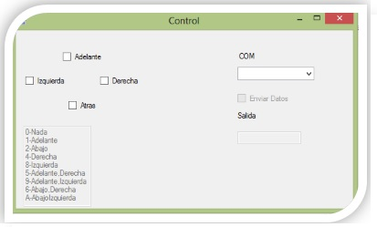
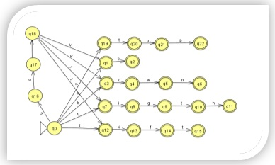
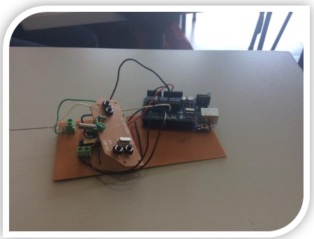
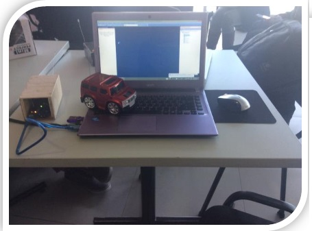

# Smar Car with C sharp

---
## Author: Juan Carlos Gonzalez

## Email: jcgi.laboral@gmail.com

## Date: December 2023

---

---
## Table of Contents

- [Project development](#Project development)
- [Non-deterministic finite automaton (AFND)](#Non-deterministic finite automaton (AFND))
- [Search algorithms](#Search algorithms) 
- [Results](#results) 

---

Develop a Artificial Intelligence for move a car inside of graph, and find the best route using A* Algorithm

Nowadays one of the goals of science is to use unmanned vehicles, to perform specific tasks where it is difficult for man to access, and that in turn he does it in an intelligent and optimal way, to make such vehicles, man resorts to artificial intelligence and computational theory to mention some branches of computing. Knowing that these types of inventions are complex, the project has been limited to only the basic actions of these, which are to be able to control the vehicle, which in this case is a car, in a different way, leaving aside its usual control. The other goal is to simulate the solution of a graph using artificial intelligence tools.

The project consists of changing the remote control of a toy car, replacing it and being able to control it through the computer, using different instructions, which will be interpreted and executed by the vehicle. Another action of the cart in the project is to solve a graph by means of search algorithms already implemented in artificial intelligence, such as: the first-in-width algorithm and the A* heuristics algorithm.

# Project development

 Initially, the use of relays in the aforementioned circuit was contemplated, but after investigating the data sheet of the integrated circuit containing the remote control, we were informed that the voltage range accepted by the integrated is 3 - 6 volts. This benefited us a lot, since the use of developers would no longer be necessary, because the 5 volts that come directly from the computer are enough to give operability to the control and to be able to send the necessary signals, which meant using the integrated circuit of the car's remote control with our circuit.

Another important point to mention is that the way the computer would communicate with the car was by the parallel port. For this purpose, a USB-to-parallel adapter cable was purchased, but we found the great disadvantage that the adapter driver is exclusively for use with parallel port printers. After an exhaustive search to find a controller that literally simulated a parallel port and with unpleasant results, it was decided to use another means of communication using the serial port with an Arduino UNO.

The Arduino (free hardware platform, based on a board with a microcontroller and a development environment), was used to connect to the computer through the serial port (COM), and thus achieve communication between the terminal (computer) and the Arduino.

Likewise, an interface in the C# language was designed and programmed using the Visual Studio IDE. This will send the data to the serial port from the interface. At the same time, a program was loaded to the arduino which would activate or deactivate certain pins, which would send the information to the intermediate circuit between the car and the Arduino. At first, the interface was only programmed so that the keyboard arrows could send the signals to the car and be able to test its correct operation.

Subsequently, the modification of the remote control continued, each terminal of the circuit was tested, to find its corresponding function (up, down, right, left). Once each function had been identified, a cable was connected to each corresponding input. With this we check that the inputs were inverted, if a logical 1 arrived the corresponding engine was not activated, but if it was a logical 0 it was activated. Therefore, it was decided to use a negation gate (integrated 7404) to reverse the inputs.

With the inputs already working, the integration of the interface with the trolley continued. The Arduino was connected to the intermediate circuit, having communication between the computer and the remote control. Using the interface we checked that the remote control was already operable with the computer, using the direction keys to activate the car's movements.

  

### Non-deterministic finite automaton (AFND)
Subsequently, an interpreter for the interaction of the car and the computer was developed, for which a non-deterministic finite automaton (AFND) was used, which are defined as mathematical models that allow representing complex situations in a more direct way, but at the same time more difficult to predict, because they can be in several states simultaneously. More formally, an AFND is defined as a mathematical model defined by the quintuple M = (Q, ∑, f, q0, F) in which:

* 	Q is a finite set called a set of states.
* 	 ∑ is a finite set of symbols, called the input alphabet.
* 	F is an application called a transition function defined as:
                                           F: (Q x ∑) x Q    	
* 	q0 is an element or state of Q, called the initial state.
* 	 F is a subset of Q, called the set of final states.
 
The representation of this automaton graphically is shown in the figure below.

  

In the image you can see the number of states they used, which in total were 23, which helped us to validate the chains.

This automaton allowed us to validate the statements that the computer would accept in order to move the cart, these statements are: up, down, right, left, no up, no down, no left, no right, stop. 
It is worth mentioning that the words in English were used to avoid entering very large words such as forward, back, right or left, as well as to avoid confusion when entering them and that the interpreter was somewhat friendlier when using it.

 
### Search algorithms
In the part of the integration of artificial intelligence, the first-in-width, dijkstra and A* heuristic algorithms were used, which represent uninformed and informed search algorithms. These types of search algorithms are the pillars of artificial intelligence, to obtain either optimal or better results, depending on what you want to find. In this case we use the algorithm of dijkstra and A* together to find the shortest path with the heuristic.
The developed program will be able to solve with any graph that is entered by the user, using two methods: the least number of hops and the lowest cost search.

Here's how they work:

* Algorithm: Search in width.
Width search is another procedure for systematically visiting all the vertices of a graph. It is particularly suitable for solving optimization problems, where the best solution must be chosen from several possible ones. You start at a vertex v (the root) which is the first active vertex. In the next step, all neighbors of the active vertex that have not been tagged are tagged as visited. All the neighbors of the children of V (who have not yet been visited) continue to be labeled.
In this process, a vertex is never visited twice, so a graph without cycles is constructed, which will be a generator tree of the connected component that contains v.
Let G (V, E) be a connected graph and v a vertex of V. The width search algorithm can be detailed as follows:
1.	We designate v as the active vertex and as the root of the generating tree T to be built. V is assigned the label 0.
2.	Let i=0 and S= {v}.
3.	Find the set M of all unlabeled vertices that are adjacent to some vertex of S.
4.	If M is empty, the algorithm ends. Otherwise, all vertices of M are labeled with i+1, the edges between each vertex of S and its neighbor in M are added to T, and S=M is made.
5.	i=i+1 and return to step 3. At the end of the process, a generator tree of the initial graph will have been built. In case of G not being connected, the algorithm would have to be modified to find a generator tree of each connected component of G.

With this algorithm, a tree is obtained where width predominates, that is, a greater number of children per node is obtained, where its number of levels is very low. This is why it was decided to use this algorithm to be able to obtain a solution to the graph based on the least number of hops.

* Dijkstra algorithm:
The dijkstra algorithm determines the shortest path from a source node to the other nodes, for this a graph whose edges have weights is required as input. 
First we mark all vertices as unused. The algorithm starts from an origin vertex that will be entered, from that vertex we will evaluate its adjacent ones, as dijkstra uses a greedy technique - The greedy technique uses the principle that for a path to be optimal, all the paths it contains must also be optimal - among all the adjacent vertices, we look for the one that is closest to our point of origin,  We take it as an intermediate point and see if we can get faster through this vertex to the others. Then we choose the next closest one (with the distances already updated) and repeat the process. We do this until the nearest unused vertex is our destination. The process of updating distances using the new vertex as an intermediate point is known as relaxation.

1.	Dijkstra method (Graph, origin):
2.	we create a priority queue Q
3.	we add source to the Q priority queue
4.	as long as Q is not empty:
i.	we take an element from the Q queue called u
Ii.	if you have already been visited, I continue to remove elements from Q    
Iii.	We mark as visited u
Iv.	for each vertex v adjacent to u in the graph:
1.	let w be the weight between vertices ( u , v )  
2.	If V has not been visited:
3.	Relaxation (U, V, W)

5.	Relaxation method (current, adjacent, weight):
6.	if distance[ current ] + weight < distance[ adjacent ]
i.	distance[ adjacent ] = distance[ current ] + weight
Ii.	we add adjacent to the priority queue Q

This algorithm is used to be able to use the A* algorithm more effectively. As A* uses a function g(n), which is the shortest distance for from the source node to the current node. In order to obtain this value, the implementation of the dijkstra algorithm was proposed and in this way calculate the minimum distance of each node.

* Algorithm A*
The A* algorithm is a search algorithm that can be used for the calculation of minimum paths in a graph. It is going to be a heuristic algorithm, since one of its main characteristics will make use of a heuristic evaluation function f(n), through which it will label the different nodes of the graph and that will serve to determine the probability of these nodes belonging to the optimal path.
This evaluation function will label the nodes of the network is in turn composed of two other functions. One of them will indicate the current distance from the source node to the node to be labeled, g(n), and the other will express the estimated distance from this node to be labeled to the destination node to which a minimum path is intended to be found, h(n).

1.	Function A*(start, goal)
2.	closed := the empty string
3.	open := {home}
4.	Father := The Empty Map
     g_valor[start] := 0
     f_valor[start] := g_valor[start] + heuristica_costo_estimado(start, goal)

5.	as long as it is not open
          current := the node in open with the lowest f_valor[]
          If current = meta
               Return Camino(Father, Goal)
          Remove Current from Open
          Add Current to Closed
          for each adjacent in the adjacency matrix (current)
               if adjacent in closed
                    continuous
               tentativa_g_valor := g_valor[current] + distancia_entre(current, adjacent)
to.	if adjacent is not in closed or tentativa_g_valor < g_valor[adjacent] 
i.	parent[adjacent] := current
                    g_valor[adjacent] := tentativa_g_valor
                    if adjacent is not open
                         Add adjacent to Open
6.	back ruling
 
Pathway Function(Parent, Current)
7.	camino_total := [current]
8.	While current is in parent:
9.	current := came_from[current]
10.	camino_total.append(current)
11.	Come back camino_total

With this algorithm it is possible to obtain a lower-cost search using heuristics, and thus obtain a correct result for the solution of a given graph.

### Results
It was possible to correctly control the car through the interface loaded into the computer, such control involves the two control variants, via chains and through the use of the navigation keys.
The task of correctly processing a graph entered by the user was completed, so that the most optimal path can be found according to the algorithm chosen by the user himself. When obtaining this solution from the graph, a simulation of its route was made by means of the movement of the car

  

  

